Лабораторная работа №4: Аутентификация и авторизация в Django
Романов Антон Сергеевич, С9121-10.05.01ммзи

Основные моменты лабораторной работы:

Расширение модели пользователя
Для гибкой работы с правами создана модель Student, связанная с встроенной моделью User через поле OneToOneField. Это позволяет хранить дополнительную информацию (например, факультет, дату рождения) отдельно, не перегружая User, и обращаться к ней через user.student_profile.

Кастомная аутентификация по email
Реализован кастомный backend, который аутентифицирует пользователя по email и паролю.

Настройка конфигураций безопасности и сессий
В settings.py настроены параметры для страниц входа/выхода, безопасности cookie и сессий, а также подключение кастомного backend-а аутентификации.

Формы регистрации и логина
Обновлены формы с учетом аутентификации по email, в том числе проверка уникальности username и email, подтверждение пароля, а также возможность входа без пароля для преподавателей.

Представления и шаблоны
Реализованы представления для главной страницы, профилей студентов и преподавателей с разной логикой отображения в зависимости от роли. Используются шаблоны с наследованием от базового base.html, где навигация и доступ к личным кабинетам рендерятся динамически.

Личные кабинеты по ролям
В профилях отображается разный контент: админ получает ссылку на админку, преподаватель — управление курсами, студент — список его курсов. Это реализовано через условное формирования контекста и шаблонов.

Навигация и интерфейс
Шапка сайта и меню адаптируются под пользователя, показывая ссылки и разделы согласно правам и роли: скрывая админку от студентов и преподавателей, разделяя дашборды.

Скриншоты корректно работающего приложения

Профиль пользователя из группы Student
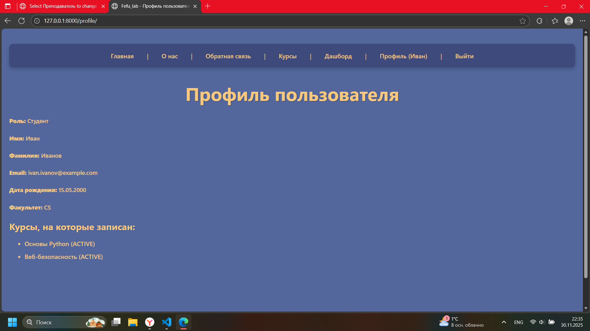
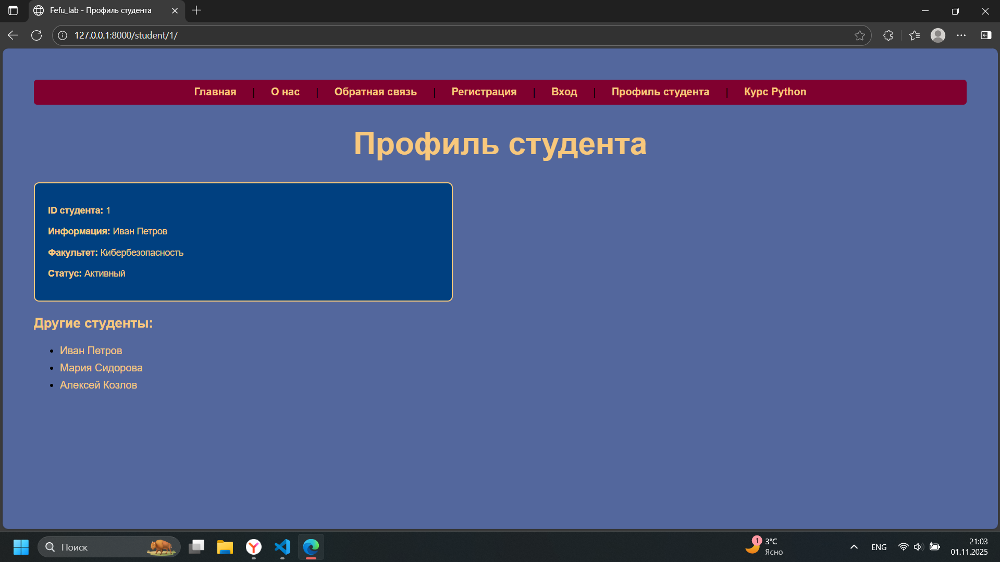
Профиль пользователя из группы Teacher
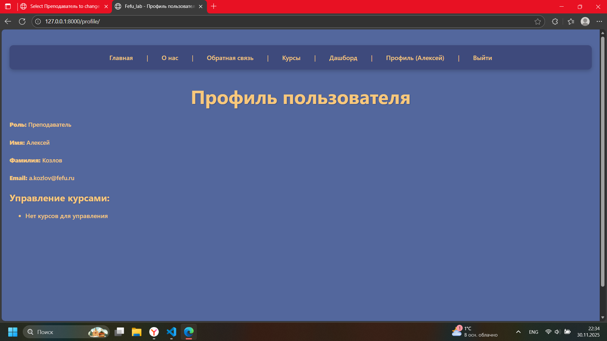
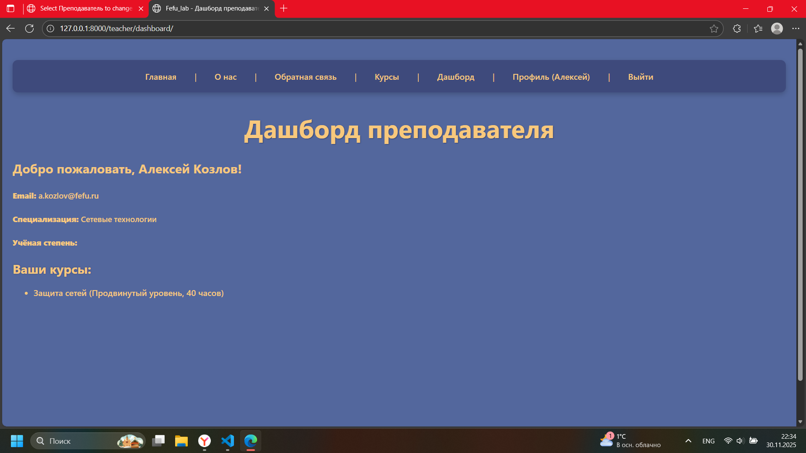
Профиль пользователя из группы Admin
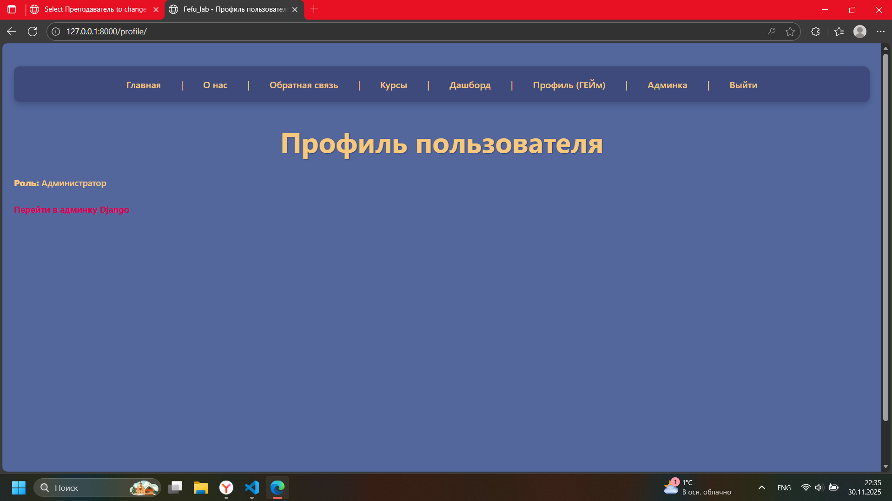
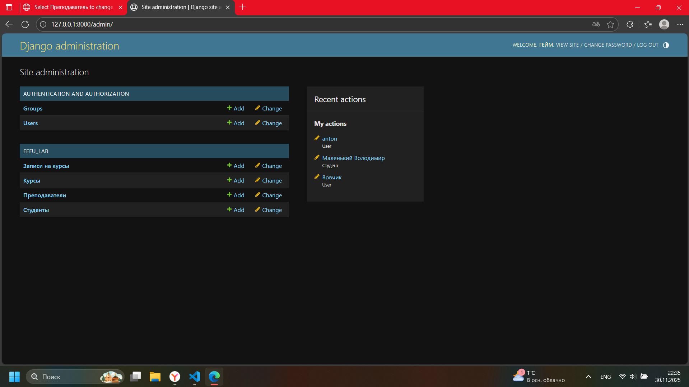
Пытаемся создать нового пользователя с почтой уже существующей в нашей БД, но нам этого не позволяют
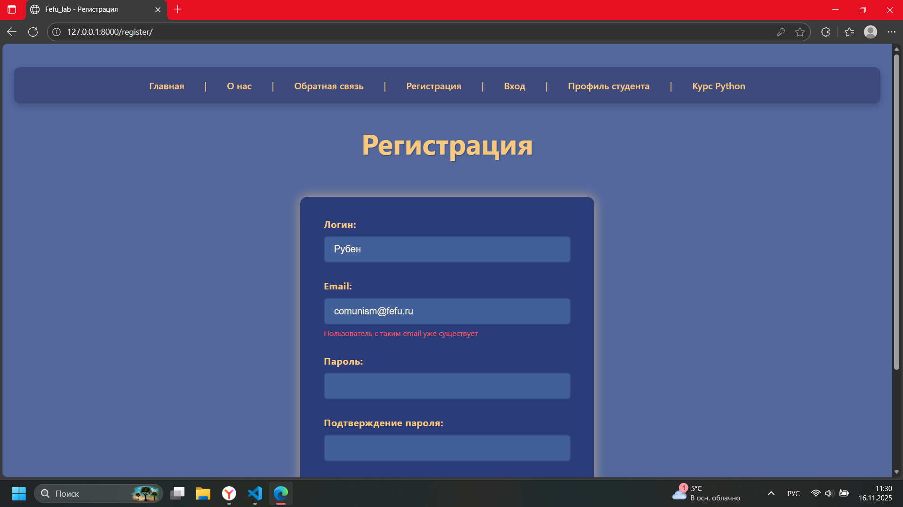
Создаем нового пользователя
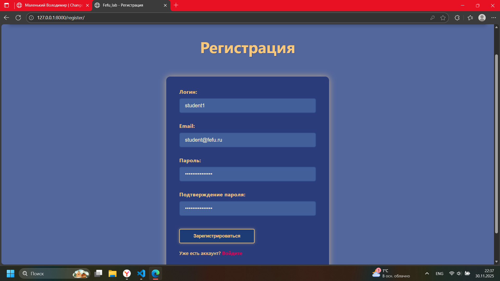
Пользователь успешно создан
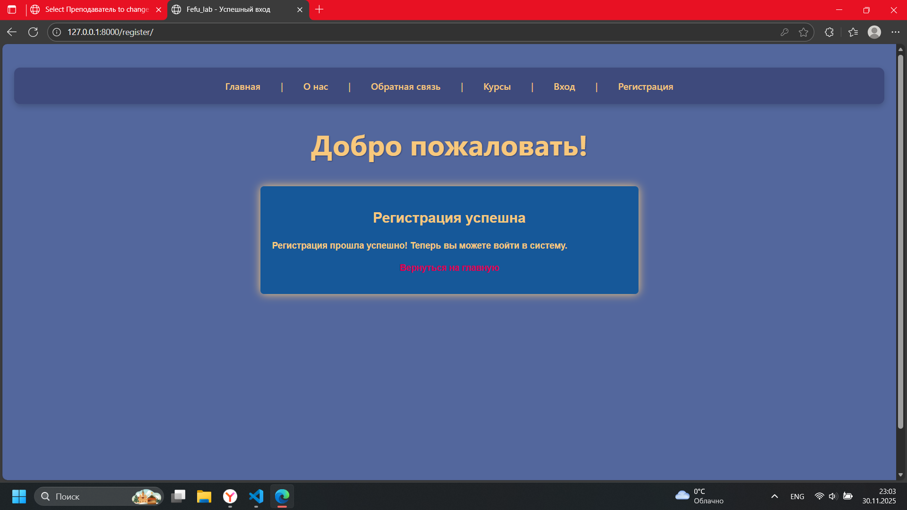
Видим, что наш новый пользователь появился на сайте
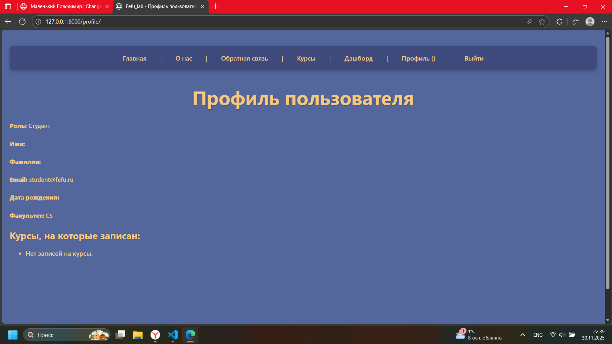
Результат авторизации с некорректными данными
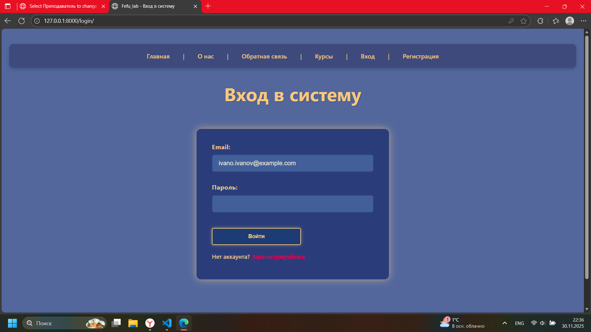
Пароли хранимые в виде хешей
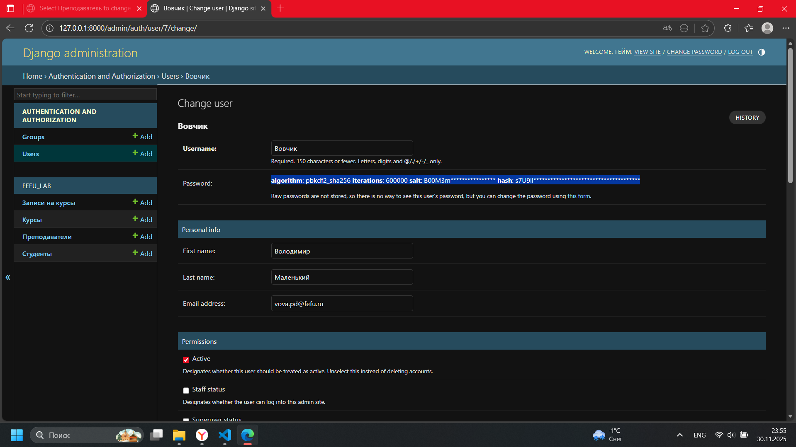