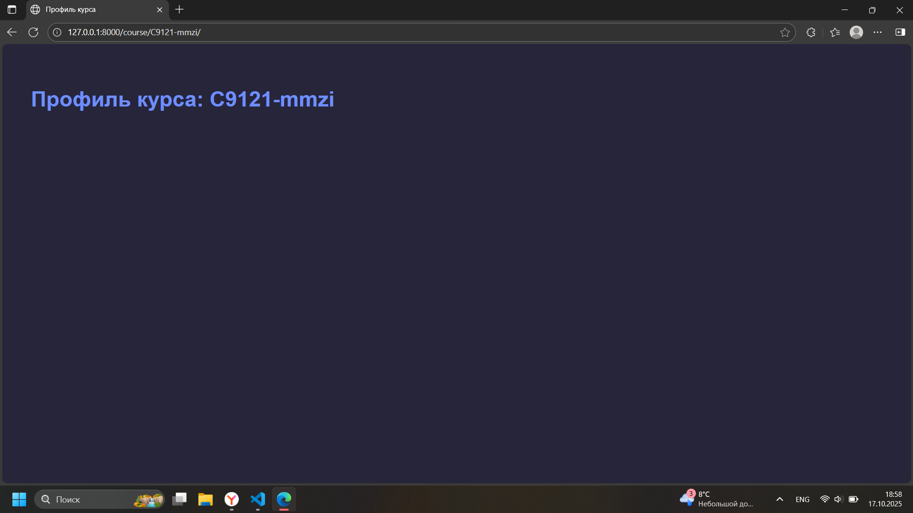
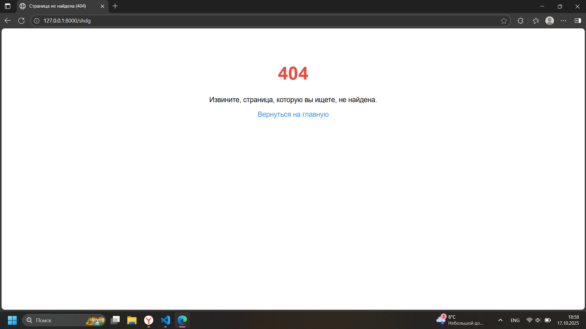

Лабораторная работа №1. Git. Django. Маршрутизация и представления
Романов Антон Сергеевич, С9121-10.05.01ммзи

Пояснения к ключевым моментам кода:
Обработчики ошибок
handler404 = 'fefu_lab.views.custom_404_view'
Этот параметр указывает Django использовать функцию custom_404_view из модуля fefu_lab.views для обработки ошибки 404 (страница не найдена).

handler500 = 'fefu_lab.views.custom_500_view'
Аналогично, этот параметр задаёт функцию custom_500_view для обработки ошибки 500 (внутренняя ошибка сервера).

path('', views.home_page, name='home')
Статический маршрут '' соответствует главной странице сайта. При заходе на корень сайта вызывается функция home_page из views. Имя маршрута — home.

path('about/', views.About_page.as_view(), name='about')
Статический маршрут about/ ведёт к странице "О нас". Здесь используется класс-представление About_page (преобразованный в функцию вызовом .as_view()). Имя маршрута — about.

path('student/< int:student_id >/', views.student_profile, name='student_profile')
Динамический маршрут с конвертером < int:student_id > означает, что в URL можно передать целочисленный идентификатор студента. Например, student/5/ вызовет функцию student_profile с параметром student_id=5. Имя маршрута — student_profile.

path('course/< slug:course_slug >/', views.course_profile, name='course_profile')
Динамический маршрут с конвертером принимает строковой параметр course_slug, использующий формат slug (состоящий из букв, цифр, дефисов). Например, course/python-20/ вызовет функцию course_profile с course_slug='python-20'. Имя маршрута — course_profile.

def home_page(request):
Использует представления на основе функций.
Принимает объект запроса request.
Использует функцию render для отображения шаблона home.html с HTTP-статусом 200 (ОК).

def About_page(View):
Представляет обработчик страницы "О нас".
Использует представления на основе классов.
Метод get отвечает на GET-запросы, возвращая шаблон about.html с кодом 200.

def student_profile(request, student_id):
Использует представления на основе функций.
Обрабатывает запрос, где student_id — идентификатор студента.
Если student_id больше 100 — возвращает страницу ошибки 404.
Иначе передаёт в шаблон student.html контекст с ID студента.

def course_profile(request, course_slug):
Использует представления на основе функций.
Аналогично профилю студента, но для курса идентифицируемого строкой course_slug.
Если длина course_slug больше 20 — показывает 404.
Иначе отдаёт шаблон course.html с передачей course_slug как данных.

Обработчики ошибок:
custom_404_view(request, exception) — возвращает страницу 404 с кодом 404.

custom_500_view(request) — возвращает страницу 500 с кодом 500.

Скрины работающего приложения

