Лабораторная работа №5: Деплой веб-приложения на виртуальной машине 
Романов Антон Сергеевич, С9121-10.05.01ммзи

Основные моменты лабораторной работы:

Настроили Ubuntu. 
Установили пакеты (python3, python3-venv, python3-pip, git, nginx, postgresql, 
postgresql-contrib, curl) 
Создали базу данных. 
Настроили доступ к ней только из localhost 
Можно на самой гостевой машине(Убунту) подключиться только по 127.0.0.1. По 
внешнему ip адресу нельзя. Аналогичная ошибка выйдет если попытаться 
подключиться из хостовой машины. Таковы настройки ограничены двумя 
файлами postgresql.conf и pg_hba.conf. 
Создали файлы настроек в файле проекта, засунули в папку deploy, поможет при 
развёртывании. 
Залили изменения на гитхаб 
На машине создали папку проекта /var/www/fefu_lab 
Скопировали репозиторий 
Запускаем скрипт
С хостовой машины мы имеем доступ к веб приложению по ip адресу 
убунту

Скриншоты корректно работающего приложения

Работающий сайт
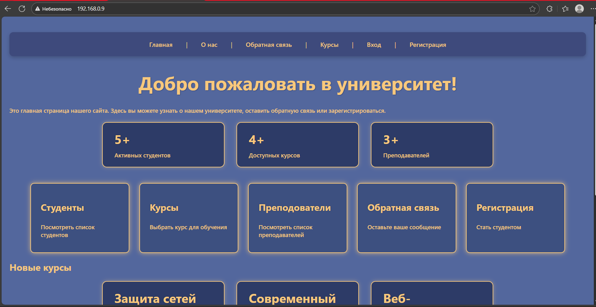
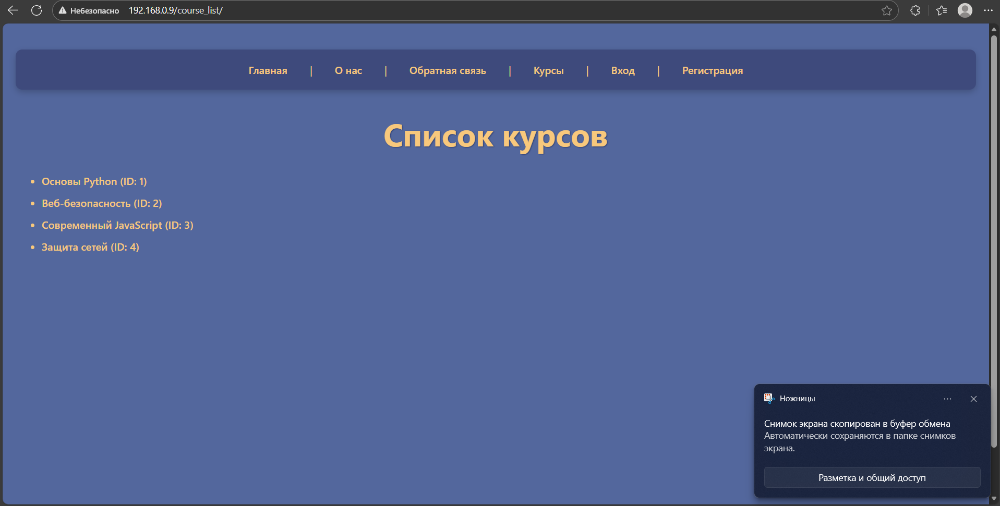
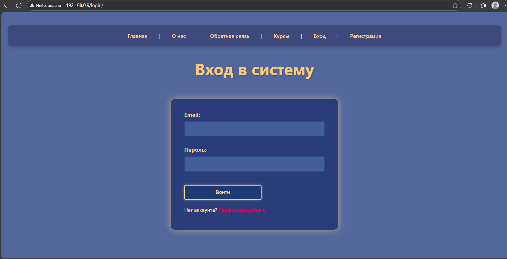
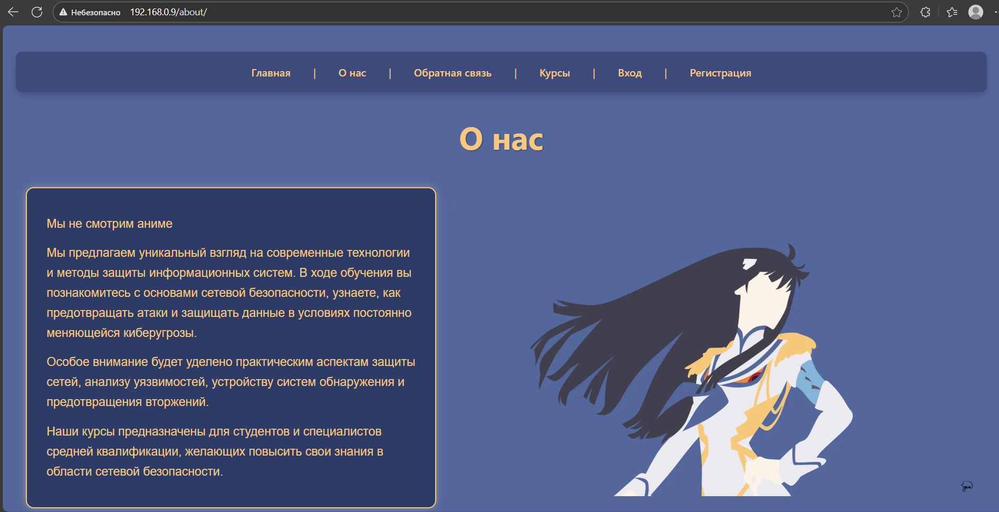
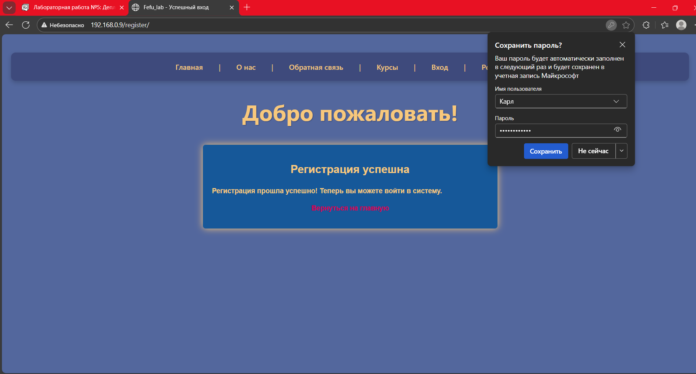
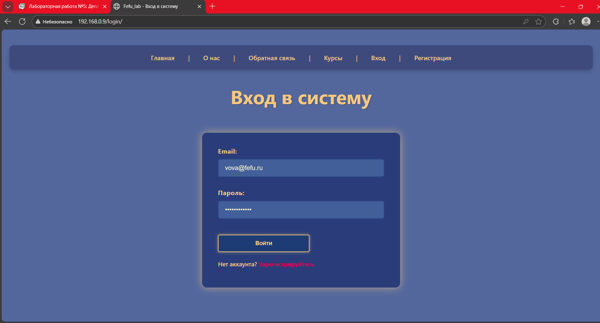
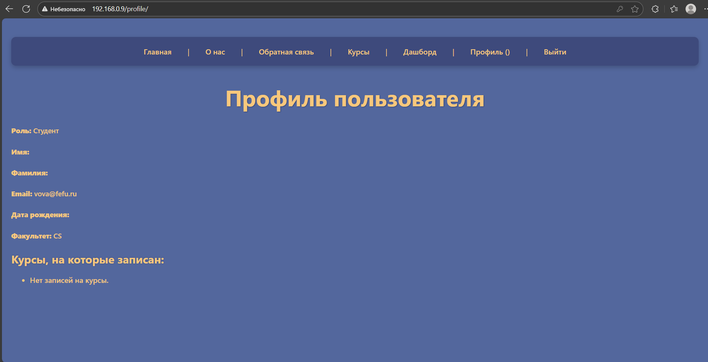
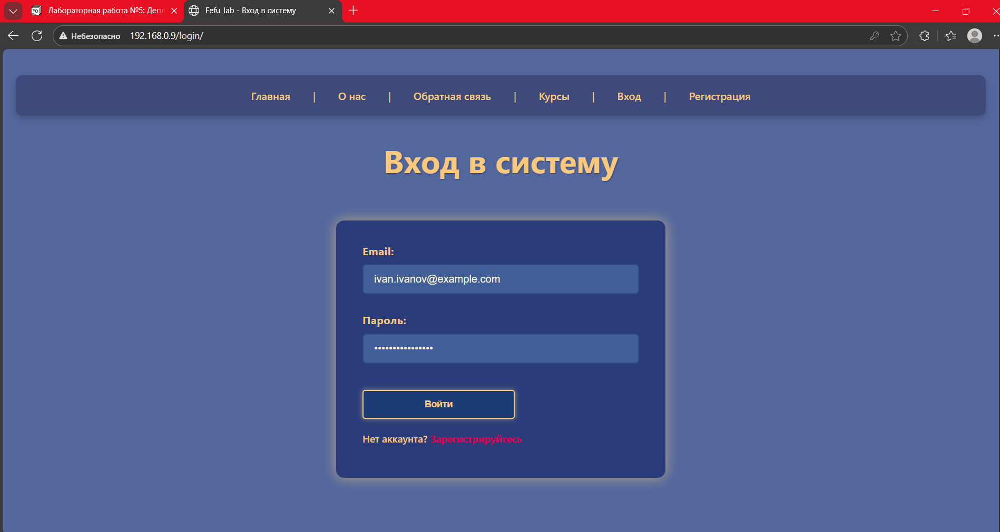
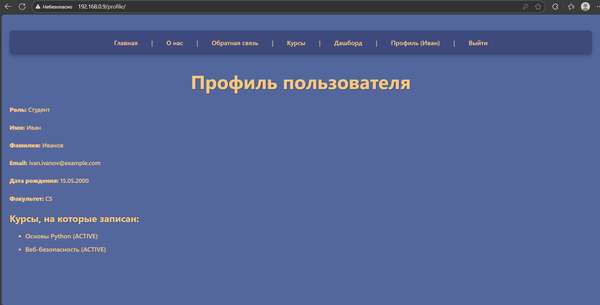
Проверим с помощью netstat на каких портах слушают приложения и nginx 
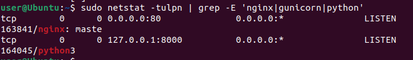
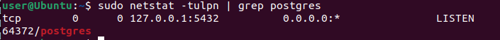
Проверим доступ к убунту по различным портам
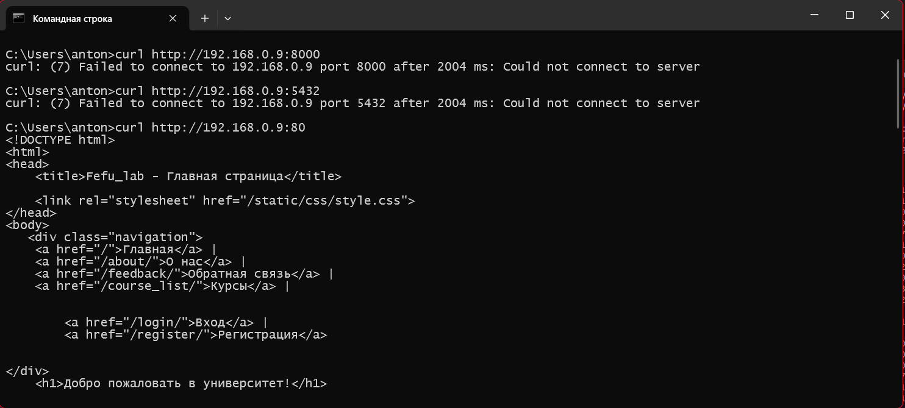
Доступ имеем только по 80 порту

Основные этапы написанного скрипта
Подготовка и проверки

Решает проблемы с dpkg lock

Устанавливает Python3, PostgreSQL, nginx, git, libpq-dev

Создает БД fefu_lab_db и пользователя fefu_user

Развертывание приложения

Активирует venv, устанавливает pip install -r requirements.txt

Выполняет Django-команды: flush, makemigrations, migrate, seed_data, collectstatic

Сохраняет/загружает данные через dumpdata/loaddata

Копирует gunicorn.service и nginx-конфиг

Настраивает права для www-data

Перезапускает nginx и gunicorn

Тестирует доступность curl http://localhost:80

Выводит статус сервисов и IP-адрес