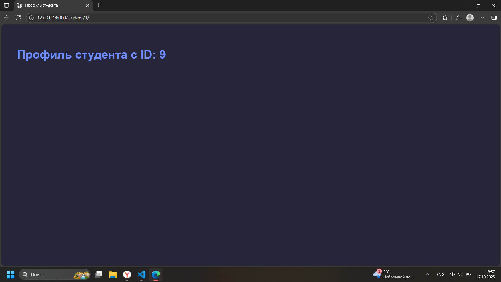

Лабораторная работа №3: Работа с базами данных и моделями Django
Романов Антон Сергеевич, С9121-10.05.01ммзи

Ключевые фрагменты кода и пояснения:

Модели (models.py)
Были созданы модели Student, Instructor, Course, Enrollment с необходимыми полями для хранения информации о студентах, преподавателях, курсах и записях на курсы. Например, модель Course включает поля title, slug, duration, instructor, level, max_students, что соответствует предметной области и требованиям задания.
Это позволяет работать с базой через ORM, обеспечивая целостность данных и простоту управления ими.

Заполнение тестовыми данными (seed_data.py)
Команда для наполнения базы тестовыми данными создает и сохраняет преподавателей, студентов, курсы и записи на курсы, что позволяет оперативно тестировать функционал без необходимости ручного ввода.

Представления (views.py)
Представления обновлены для работы с реальными моделями:

home_page собирает статистику по студентам, курсам и преподавателям из базы и передает для рендеринга.

student_profile и course_profile выводят детальную информацию о конкретных студентах и курсах с помощью get_object_or_404, обеспечивая корректную обработку несуществующих записей.

Добавлены формы регистрации и логина с проверкой уникальности имени и email, с интеграцией в базу через модели Django и собственную модель Student, что соответствует требованиям безопасной и полноценной регистрации.

Формы (forms.py)
Реализованы формы на основе Django Forms и ModelForms для удобной валидации и обработки данных пользователей, регистраций и обратной связи. Применена проверка уникальности email в базе студентов и пользователей Django, что гарантирует отсутствие дубликатов.

Шаблоны (templates)
Используется наследование от базового шаблона base.html для унификации интерфейса.

В шаблонах профиля студента и деталей курсов применены динамичные данные и циклы для отображения списков, ссылки генерируются через , что обеспечивает устойчивость к изменениям маршрутов.

Скриншоты корректно работающего приложения

Профиль пользователя из группы Student

Профиль пользователя из группы Teacher

Профиль пользователя из группы Admin

Пытаемся создать нового пользователя с почтой уже существующей в нашей БД, но нам этого не позволяют

Создаем нового пользователя

Пользователь успешно создан

Видим, что наш новый пользователь появился на сайте

Результат авторизации с некорректными данными

Пароли хранимые в виде хешей
