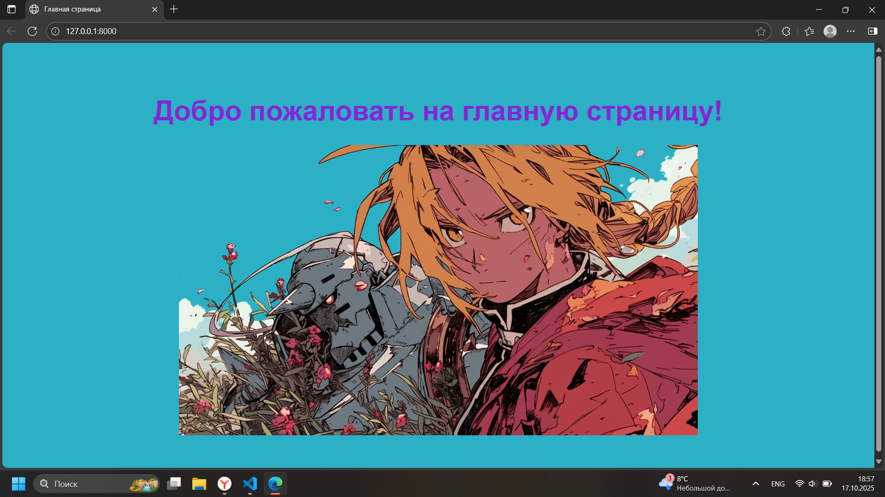

Лабораторная работа №2. Шаблоны, статические файлы, веб-формы и серверная обработка пользовательского ввода
Романов Антон Сергеевич, С9121-10.05.01ммзи

Пояснения к ключевым моментам кода:
CSRF-защита
<form method="post">
    
    
    
        ...
    
</form>
<form method="post"> — создаёт HTML-форму, которая отправляет данные методом POST на тот же URL, где она отображается. POST используется при отправке данных, чтобы они не отображались в адресной строке и сервер мог обрабатывать их для изменения состояния (например, сохранения).
 — это встроенный в Django шаблонный тег, который вставляет в форму скрытое поле с уникальным CSRF-токеном (Cross-Site Request Forgery token). Этот токен защищает приложение от CSRF-атак, когда злоумышленник пытается отправить данные от имени пользователя без его ведома. Токен проверяется сервером при получении POST-запроса и позволяет подтвердить, что запрос пришёл с вашего сайта, а не с чужого.
 — это цикл по всем полям формы, переданной в шаблон из views. Django автоматически рендерит HTML элементы для каждого поля вместе с подписью (label), виджетом ввода и возможными ошибками. Такой подход упрощает создание форм, позволяет гибко кастомизировать их вид и удобно показывать ошибки валидации.
Таким образом, данные строки обеспечивают корректную отправку формы с защитой CSRF и удобный вывод полей формы в шаблоне.
При отправке запроса с подмененным/отсутствующим csrf токеном получаем ошибку. Для проверки:
- открываем инструменты разработчика и находим там csrfmiddlewaretoken

- заменяем его на значение на произвольное значение

Заполняем логин-пароль, отправляем запрос и получаем ошибку

Проверка работоспособности
Окно регистрации
class RegistrationForm(forms.Form):
    username = forms.CharField(
        max_length=50,
        label='Логин',
        widget=forms.TextInput(attrs={'class': 'form-control'})
    )
    email = forms.EmailField(
        label='Email',
        widget=forms.EmailInput(attrs={'class': 'form-control'})
    )
    password = forms.CharField(
        label='Пароль',
        widget=forms.PasswordInput(attrs={'class': 'form-control'})
    )
    password_confirm = forms.CharField(
        label='Подтверждение пароля',
        widget=forms.PasswordInput(attrs={'class': 'form-control'})
    )
    def clean_username(self):
        username = self.cleaned_data['username']
        if User.objects.filter(username=username).exists():
            raise ValidationError("Пользователь с таким логином уже существует")
        return username

    def clean_email(self):
        email = self.cleaned_data['email']
        if User.objects.filter(email=email).exists():
            raise ValidationError("Пользователь с таким email уже существует")
        return email

    def clean_password(self):
        password = self.cleaned_data['password']
        validate_password(password)  # проверка сложности пароля
        return password

    def clean(self):
        cleaned_data = super().clean()
        password = cleaned_data.get('password')
        password_confirm = cleaned_data.get('password_confirm')
        if password and password_confirm and password != password_confirm:
            self.add_error('password_confirm', "Пароли не совпадают")
Поля формы (username, email, password, password_confirm) описываются с нужными виджетами и метками.

Метод clean_<fieldname>() выполняет валидацию конкретного поля:

clean_username() проверяет, что введённый логин уникален (нет другого пользователя с таким логином).

clean_email() проверяет уникальность email.

clean_password() применяет встроенные валидаторы паролей Django, которые проверяют сложность (например, минимальную длину и другие правила, заданные в AUTH_PASSWORD_VALIDATORS).

Метод clean() вызывается после индивидуальных валидаций полей и позволяет проверять несколько полей вместе.

Здесь проверяется, что пароль и его подтверждение совпадают.

Для поля password_confirm при несовпадении добавляется ошибка через add_error(), чтобы эта ошибка отображалась рядом с полем подтверждения.

Такой подход обеспечивает комплексную server-side валидацию каждого поля и взаимосвязанных данных формы, а также подготовку корректных ошибок для отображения пользователю.

Окно входа
class LoginForm(forms.Form):
    username = forms.CharField(
        max_length=50,
        label='Логин',
        widget=forms.TextInput(attrs={'class': 'form-control'})
    )
    password = forms.CharField(
        label='Пароль',
        widget=forms.PasswordInput(attrs={'class': 'form-control'})
    )
    def clean(self):
        cleaned_data = super().clean()
        username = cleaned_data.get('username')
        password = cleaned_data.get('password')

        if username and password:
            user = authenticate(username=username, password=password)
            if user is None:
                raise forms.ValidationError("Неверный логин или пароль")
        return cleaned_data
    def get_user(self):
        return getattr(self, 'user', None)
Код класса LoginForm служит для реализации формы входа пользователя с проверкой аутентификации:

В полях формы:

username — текстовое поле для ввода логина с ограничением длины до 50 символов и CSS-классом для оформления.

password — поле для ввода пароля с отображением скрытого текста.

Метод clean(self):

Вызывается при валидации всей формы.

Извлекает из очищенных данных (cleaned_data) значения username и password.

Если обе переменные существуют, вызывается функция authenticate(username=username, password=password) из Django — она пытается найти пользователя с таким логином и паролем.

Если пользователь не найден (authenticate вернул None), генерируется исключение forms.ValidationError с сообщением "Неверный логин или пароль".

Это препятствует успешному прохождению валидации формы и позволяет отобразить ошибку пользователю.

Метод get_user(self) возвращает объект пользователя, записанный в атрибут self.user во время аутентификации в clean(). Если self.user не присвоен, возвращает None. Это позволяет извлекать аутентифицированного пользователя после успешной валидации формы.

Таким образом, вся проверка учетных данных происходит server-side в форме, и при ошибке в логине или пароле форма считается невалидной с отображением ошибки. После успешной валидации можно получить пользователя и выполнить вход в систему.

Успешный вход

Ввод неверного пароля

Окно обратной связи

class FeedbackForm(forms.Form):
    name = forms.CharField(
        label='Имя',
        required=True,
        widget=forms.TextInput(attrs={'class': 'form-control'})
    )
    email = forms.EmailField(
        label='Email',
        required=True,
        widget=forms.EmailInput(attrs={'class': 'form-control'})
    )
    subject = forms.CharField(
        label='Тема сообщения',
        required=True,
        widget=forms.TextInput(attrs={'class': 'form-control'})
    )
    message = forms.CharField(
        label='Текст сообщения',
        required=True,
        widget=forms.Textarea(attrs={'class': 'form-control'})
    )

    def clean_name(self):
        name = self.cleaned_data['name']
        if len(name.strip()) < 2:
            raise ValidationError("Имя должно содержать минимум 2 символа")
        return name.strip()

    def clean_message(self):
        message = self.cleaned_data['message']
        if len(message.strip()) < 10:
            raise ValidationError("Сообщение должно содержать минимум 10 символов")
        return message.strip()
Код формы FeedbackForm:

Определяет обязательные поля:

name с меткой Имя, обязательное для заполнения, с CSS-классом оформления.

email с меткой Email, тоже обязательное, с валидацией формата e-mail.

subject с меткой Тема сообщения, обязательное текстовое поле.

message с меткой Текст сообщения, обязательное текстовое поле с виджетом Textarea.

Метод clean_name(self) — кастомная проверка для поля Имя:

Получает введённое имя, убирает пробелы с начала и конца.

Если длина после обрезки меньше 2 символов — выбрасывает исключение ValidationError с сообщением, что имя должно содержать минимум 2 символа.

Возвращает очищенное значение.

Метод clean_message(self) — кастомная проверка для поля Текст сообщения:

Аналогично убирает пробелы и проверяет минимальную длину (не менее 10 символов).

При несоответствии выбрасывает ValidationError с сообщением о минимальной длине.

def student_profile(request, student_id):
    if student_id in STUDENTS_DATA:
        student_data = STUDENTS_DATA[student_id]
        return render(request, 'student.html', {
            'student_id': student_id,
            'student_info': student_data['info'],
            'faculty': student_data['faculty'],
            'status': student_data['status'],
            'year': student_data['year']
        })
    else:
        return render(request, '404.html', status=404)
Это Django view-функция, которая принимает объект запроса request и идентификатор студента student_id.

STUDENTS_DATA —  словарь, где ключ — student_id, а значение — данные студента (словарь с ключами info, faculty, status, year).

Если student_id найден в STUDENTS_DATA, из этого словаря берутся сведения о студенте.

Затем вызывается функция render, которая формирует HTTP-ответ с использованием шаблона student.html и передаёт в него данные студента: идентификатор, сведения, факультет, статус и год обучения.

Если student_id отсутствует в данных, возвращается страница 404 с шаблоном 404.html и соответствующим статусом HTTP 404 (страница не найдена).

def login_view(request):
    if request.method == 'POST': 
        form = LoginForm(request.POST) 
        if form.is_valid(): 
            user = form.get_user() 
            
            return render(request, 'success.html', { 
                'message': 'Вход выполнен успешно! Добро пожаловать в систему.',
                'title': 'Вход в систему'
            })
    else:
        form = LoginForm() 
    
    return render(request, 'login.html', { 
        'form': form, 
        'title': 'Вход в систему'
    })
Код функции login_view реализует обработку формы входа пользователя следующим образом:

При запросе методом POST:

Создаётся объект формы LoginForm с данными из POST-запроса.

Вызывается метод form.is_valid(), который проверяет корректность введённых данных и аутентифицирует пользователя (если аутентификация реализована в форме).

Если форма валидна, вызывается form.get_user(), возвращающий объект аутентифицированного пользователя.

В ответ рендерится страница success.html с сообщением об успешном входе.

При запросе методом GET:

Создаётся пустая форма LoginForm, которая будет выведена пользователю.

В обоих случаях (GET и POST с ошибками) выполняется рендеринг шаблона login.html с формой и заголовком.

Скриншоты корректно работающего приложения

